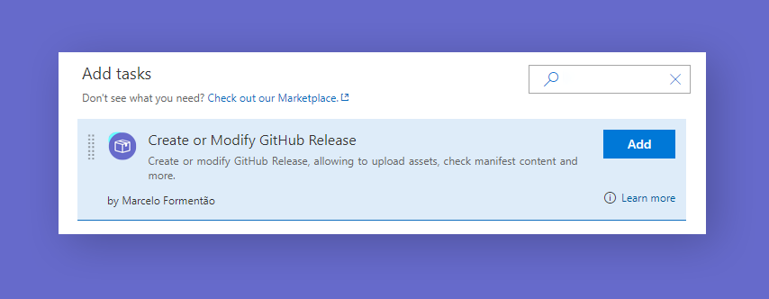

# GitHub Tool

GitHub Tool provide full implementation to Create and Modify GitHub Release to Azure DevOps Build and Release Management.

## Tasks included

- [**Create or Modify GitHub Release:**](https://github.com/marceloavf/github-tools-vsts/wiki#create-or-modify-github-release-task) Create or modify GitHub Release, allowing to upload assets, check manifest content and more.




Options include:

- **GitHub Connection:** Connect to a service endpoint for your GitHub Connection.
- **Repository:** List all repositories based on Endpoint. If empty, it will be extracted from manifest file.
- **Tag:** Create a tag to release. If empty, the version will be extracted from manifest file.
- **Release Title:** Create a title to release. If empty, it will be the same as tag.
- **Release Notes:** Create a note to release. If empty, it will be left undefined.
- **Draft:** Check to release tagged as Draft.
- **Pre Release:** Check to release tagged as Pre Release.
- **Ignore Assets:** Check to skip upload assets to release.
- **Files to Upload as Assets:** Include files to upload as artifacts to release. Minimatch pattern are supported.
- **Manifest JSON:** Include the manifest file from which default values will be extracted if options are missing. [More Info.](https://github.com/marceloavf/github-tools-vsts#manifest-file)

Advanced Options include:

- **Reuse Release:** Check to allow to reuse a release with the same tag.
- **Reuse only Draft Release:** Check to allow to reuse only draft release. Prevents from editing already published releases.
- **Skip Duplicated Assets:** Check to prevent the plugin to replace assets with the same name.
- **Edit Release** Check to allow to edit release name, notes, type (`draft, prerelease, release`) and target commitsh. [More Info.](https://github.com/marceloavf/github-tools-vsts#edit-release)
- **Delete Empty Tag** Check to delete tag if it's editing release type from `prerelease` or `release` to `draft`
- **Target Commitsh:** Specifies the commitsh value that determines where the Git tag is created from. Can be any branch or commit SHA. Defaults to the default branch of the repository.
- **API URL:** Allow to use a custom API URL to connect to GitHub Enterprise instead of github.com. Defaults to 'https://api.github.com'.

> Modify will only be valid if the release has the same tag as the other one, and you have to allow Reuse Release or/and Reuse only Draft Release

## Modify

### Overwrite assets

1. The release tag option should have the same tag of the release you want to change.
2. The assets should have the same name to replace.
3. Leave unchecked `Skip Duplicated Assets` inside `Advanced` options.

### Edit release

This option allow to edit release properties based on `tag name`, changing the release name, notes, type (`draft, prerelease, release`) and target commitsh.

1. The release tag option should have the same tag of the release you want to change.
2. Write different name, notes, target commitsh or change the type of the release.
3. Check `Edit Release` inside `Advanced` options.

> Tip: `Delete Empty Tag` option allow to prevent an empty tag (without release) by deleting it when you edit release type from `prerelease` or `release` to `draft`

## More details

### Manifest file

The manifest is a json file (commonly called `package.json`) that include some information about your application, the GitHub Tool can extract these information when you indicate in `Manifest JSON` field where json file is located. Your json should be like this example below.

```json
{ 
   "version": "2.0.0", 
   "repository": { 
     "type": "git", 
     "url": "https://github.com/owner/repo" 
  } 
} 
```

### GitHub Connection

This option is one of the mandatory fields to allow GitHub Tool interact with GitHub API. For this, you have two options to create this connection:

#### 1. Authorize using OAuth

This service provides you direct and fast connection with GitHub authentication. If you need to modify some access and grant new authorizations you will have to access your GitHub acoount, go to `Settings` > `Applications` > `Authorized OAuth Apps`, found `Azure DevOps` and modify permissions and organization access.

#### 2. Authorize with a GitHub personal access token

This option needs a personal access token from GitHub, you can create it by going to your GitHub account, `Settings` > `Developer settings` > `Personal access tokens` and click on `Generate New Token`.

| Scope  | Description |
| ------------- | ------------- |
| repo  | Allow access to private repositories  |
| public_repo  | Allow access to public repositories  |

## Known Issues

Please refer to our [wiki page](https://github.com/marceloavf/github-tools-vsts/wiki/Known-Issues)

## Learn More

The [source](https://github.com/marceloavf/github-tools-vsts) for this extension is on GitHub. Take a look at [contributing section](https://github.com/marceloavf/github-tools-vsts#contribute), fork and extend.

## Release Notes

Please refer to our [release page on Github](https://github.com/marceloavf/github-tools-vsts/releases)