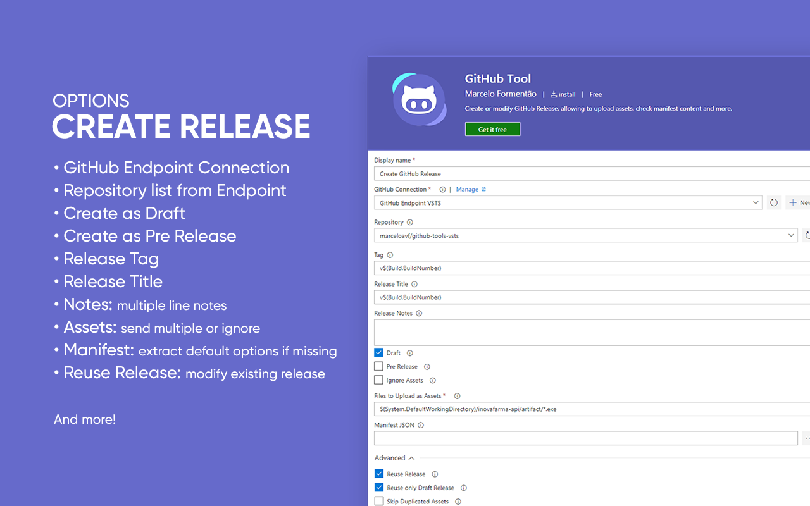

# GitHub Tool Task

GitHub Tool Task provide full implementation to Create and Modify GitHub Release to Visual Studio Team Services Build and Release Management.

# Tasks included

- **Create or Modify GitHub Release:** Create or modify GitHub Release, allowing to upload assets, check manifest content and more.

Options include:

- **GitHub Connection:** Connect to a service endpoint for your GitHub Connection.
- **Repository:** List all repositories based on Endpoint. If empty, it will be extracted from manifest file.
- **Tag:** Create a tag to release. If empty, the version will be extracted from manifest file.
- **Release Title:** Create a title to release. If empty, it will be the same as tag.
- **Release Notes:** Create a note to release. If empty, it will be left undefined.
- **Draft:** Check to release tagged as Draft.
- **Pre Release:** Check to release tagged as Pre Release.
- **Ignore Assets:** Check to skip upload assets to release.
- **Files to Upload as Assets:** Include files to upload as artifacts to release. Minimatch pattern are supported.
- **Manifest JSON:** Include the manifest file from which default values will be extracted if options are missing.

Advanced Options include:

- **Reuse Release:** Check to allow to reuse a release with the same tag.
- **Reuse only Draft Release:** Check to allow to reuse only draft release. Prevents from editing already published releases.
- **Skip Duplicated Assets:** Check to prevent the plugin to replace assets with the same name.
- **Target Commitsh:** Specifies the commitsh value that determines where the Git tag is created from. Can be any branch or commit SHA. Defaults to the default branch of the repository.
- **API URL:** Allow to use a custom API URL to connect to GitHub Enterprise instead of github.com. Defaults to 'https://api.github.com'.